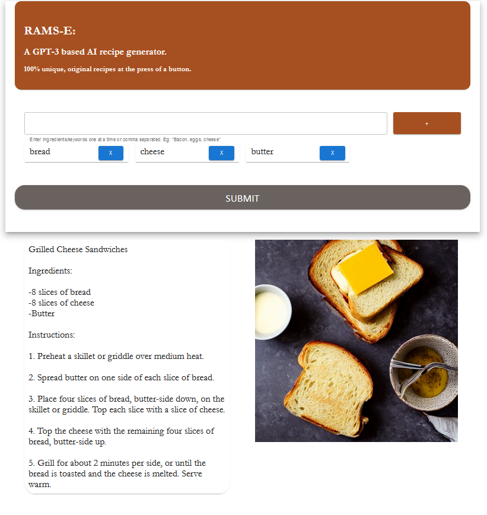

# Rams-E
A GPT-3 based AI recipe generator.  
100% unique, original recipes at the press of a button.   

Natural language model for recipe generation using OpenAI davinci GPT-3 API.

Image diffusion and AI image generation by Replicate stable-diffusion API.  

Backend written in Python, frontend written in Typescript & React



# Dependencies
### AI Libraries:   
[OpenAI](https://beta.openai.com/docs/quickstart/closing)  
[Replicate](https://replicate.com/docs/get-started/python)  

### Backend:
[Flask](https://flask.palletsprojects.com/en/2.2.x/)  
[Flask CORS](https://flask-cors.readthedocs.io/en/latest/)  

### Frontend:  
[React](https://reactjs.org/)  
[MaterialUI](https://mui.com/)  
[Axios](https://axios-http.com/docs/intro)  

# Getting Started
Create free API keys for [OpenAI](https://beta.openai.com/account/api-keys) and 
[Replicate](https://replicate.com/account).  
Add these to <b>/backend/keys.json</b> in the following format  
```json
{
  "openai": "sk-t9287vbtr2hm298r0v2n7fyvasd3hgj38",
  "replicate": "89b0m91cejuh28he7c8120ehcsada901u1023"
}
```


In a terminal, run <b>RecipeGen.py</b> with the command
```batch
python /backend/RecipeGen.py
```

In another terminal run the React front end with the command
```
cd frontend
npm start
```
